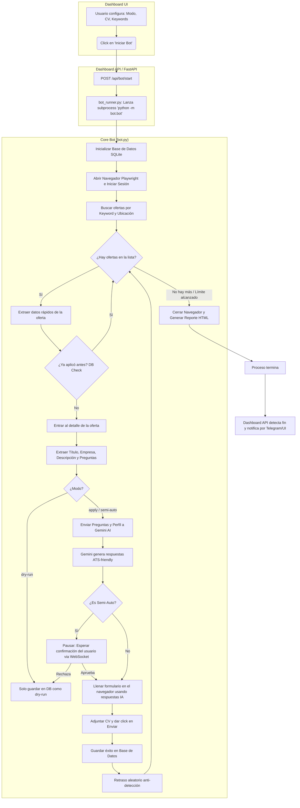

# Arquitectura y Flujo del Bot de Computrabajo

Este documento explica cómo funciona el bot de automatización de Computrabajo, desde que el usuario interactúa con el Dashboard hasta que la IA completa una postulación.

## 1. Diagrama de Flujo Principal

A continuación se presenta el flujo de ejecución completo del sistema:



---

## 2. Pseudocódigo del Ciclo de Vida del Bot

### A. Capa del Dashboard (`bot_runner.py`)

```text
FUNCION iniciar_bot(modo, keywords, max_aplicaciones):
    SI el bot ya está corriendo:
        RETORNAR error

    CREAR SUBPROCESO: "python -m bot.bot --mode <modo>"
  
    INICIAR HILO de lectura de logs:
        MIENTRAS el subproceso esté vivo:
            LEER línea de texto impresa por el bot
            AGREGAR marca de tiempo [HH:MM:SS]
            ENVIAR línea al Frontend via WebSockets
          
            SI la línea dice "[SEMI-AUTO] confirmar":
                PAUSAR el bot y enviar alerta a la UI
              
    RETORNAR "Bot iniciado"
```

### B. Capa Core del Bot (`bot/bot.py`)

```text
FUNCION principal(modo, keyword_objetivo, max_aplicaciones):
    db_manager = CONECTAR_BASE_DE_DATOS("applications.db")
    navegador = INICIAR_PLAYWRIGHT(headless=False)
  
    navegador.IR_A("computrabajo.com/login")
    navegador.LLENAR("email", CT_EMAIL)
    navegador.LLENAR("password", CT_PASSWORD)
    navegador.CLICK("Ingresar")
  
    navegador.IR_A( URL_BUSQUEDA(keyword_objetivo, ubicación) )
  
    ofertas = navegador.OBTENER_LISTA_DE_TARJETAS()
    aplicaciones_exitosas = 0
  
    PARA CADA oferta EN ofertas:
        SI aplicaciones_exitosas >= max_aplicaciones:
            ROMPER BUCLE
          
        url_oferta = oferta.COMPROBAR_HREF()
      
        SI db_manager.YA_APLICO(url_oferta):
            CONTINUAR (saltar a la siguiente)
          
        navegador.ENTRAR_A_OFERTA(url_oferta)
        descripcion, preguntas = navegador.EXTRAER_TEXTO_Y_PREGUNTAS()
      
        SI modo == "dry-run":
            db_manager.GUARDAR(estado="dry-run")
            CONTINUAR
          
        # --- Llamada a Inteligencia Artificial ---
        respuestas_ia = ai_responder.ANALIZAR_Y_RESPONDER(
            perfil_candidato=cv_data.json,
            descripcion_oferta=descripcion,
            preguntas_filtro=preguntas
        )
      
        SI modo == "semi-auto":
            ESPERAR_APROBACION_DEL_USUARIO()
            SI usuario_rechaza:
                CONTINUAR
              
        # --- Interacción con la página ---
        navegador.LLENAR_PREGUNTAS(respuestas_ia)
        navegador.SUBIR_PDF(CV_SELECCIONADO)
        navegador.CLICK("Enviar mi CV")
      
        SI navegador.MUESTRA_EXITO():
            db_manager.GUARDAR(estado="aplicado")
            aplicaciones_exitosas += 1
          
        ESPERAR_ALEATORIO(3, 8, "segundos") # Evitar baneo anti-bot
      
    GENERAR_REPORTE_HTML(db_manager.obtener_resumen())
    navegador.CERRAR()
    FIN DEL PROGRAMA
```

### C. Capa de IA (`bot/ai_responder.py`)

```text
FUNCION ANALIZAR_Y_RESPONDER(perfil, descripcion, preguntas):
    SI NO hay preguntas:
        RETORNAR nulo
      
    PROMPT = Construir texto inyectando:
        1. "Eres un experto en RRHH. Ayuda a César..."
        2. Contexto actual: "Hoy es Octubre 2026, graduado en 2025..."
        3. Perfil: {datos de cv_data.json}
        4. Oferta: {texto de la descripción}
        5. Preguntas: {lista de inputs encontrados en el HTML}
      
    MANDAR_A_GEMINI(PROMPT)
    RESPUESTA_RAW = Recibir texto del modelo
  
    JSON_LIMPIO = Parsear_Y_Limpiar_Respuesta(RESPUESTA_RAW)
  
    RETORNAR JSON_LIMPIO (Ej: {"pregunta_1": "Tengo 3 años de exp...", "salario": "3000000"})
```

---

## 3. Resumen de Archivos Principales

1. **`dashboard/api/main.py`**: El servidor web que sirve el panel de control y escucha eventos.
2. **`dashboard/api/services/bot_runner.py`**: El puente entre la web y el bot. Se encarga de lanzar el bot real como un programa independiente y capturar lo que imprime en la consola para mandarlo a la web.
3. **`bot/bot.py`**: El orquestador principal. Aquí vive la lógica de navegación paso a paso.
4. **`bot/browser.py`**: Envolturas de código para Playwright. Se especializa en saber cómo hacer click específicamente en los botones de Computrabajo y cómo leer su código HTML.
5. **`bot/ai_responder.py`**: Encargado de hablar con Google Gemini. Toma las preguntas de la página y los datos de tu CV y le pide a la IA que genere la mejor respuesta posible.
6. **`bot/job_tracker.py`**: La memoria del bot. Accede a la base de datos SQLite para asegurarse de que no apliques a la misma oferta dos veces y genera los archivos HTML de reporte final.
